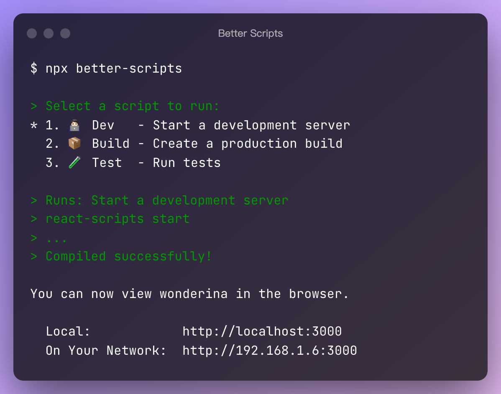
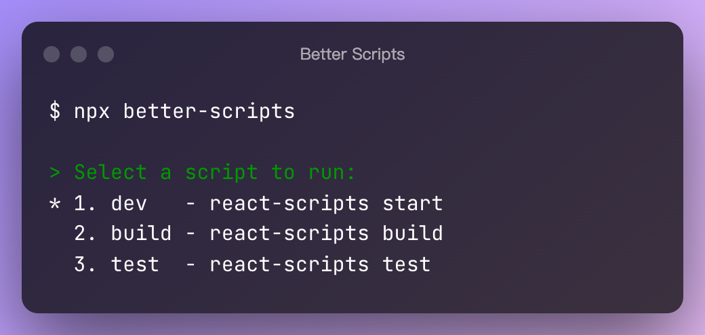
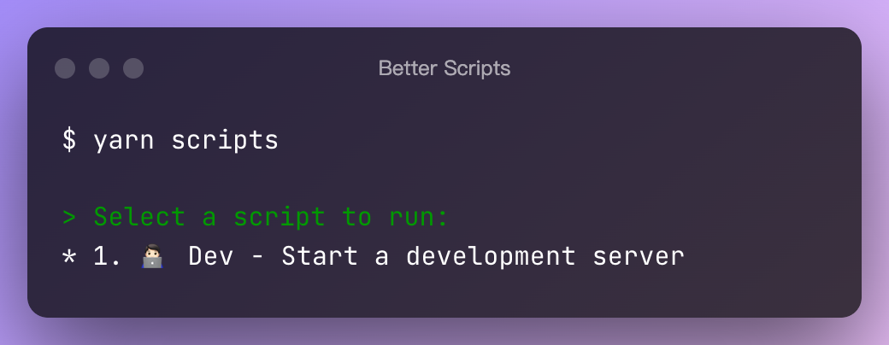

<br />
<h1 align="center">➤_ Better Scripts</h1>

<br>
<p align="center"><strong>A better way to organize your npm scripts</strong></p>
<br>

<p align="center">
  
</p>

- [Installation](#installation)
- [Usage](#usage)
  - [Basic setup](#basic-setup)
  - [Add script description](#add-script-description)
  - [Script as object](#script-as-object)
  - [Separate configuration file](#separate-configuration-file)
  - [Specifity configuration file](#specifity-configuration-file)
- [Advanced](#advanced)
- [License](#license)

## Installation

Install with yarn

```sh
yarn add better-scripts -D
```

Or install with npm

```sh
npm install better-scripts --save-dev
```

Or install with pnpm

```sh
pnpm add better-scripts -D
```

Or use npx for one-time use

```sh
npx better-scripts
```

## Usage

### Basic setup

Simply run `npx better-scripts` will read your existing scripts, let's give it try at first

```sh
npx better-scripts
```

<p align="center">
  
</p>

Now, let's add move all `scripts` into `better-scripts` and add only one `"scripts": "better-scripts"` in `scripts`

```json
{
  "scripts": {
    "scripts": "better-scripts"
  },
  "better-scripts": {
    "dev": "react-scripts start",
    "build": "react-scripts build",
    "test": "react-scripts test"
  }
}
```

Then run `yarn scripts` will read your scripts from `better-scripts`

```sh
yarn scripts
```

### Add script description

Second value as description in array form

```json
{
  "better-scripts": {
    "dev": ["react-scripts start", "Start a development server"]
  }
}
```

<p align="center">
  
</p>

### Script as object

You can add more properties in object form

```json
{
  "better-scripts": {
    "dev": {
      "alias": "🧑🏻‍💻 Dev",
      "script": "react-scripts start",
      "desc": "Start a development server"
    }
  }
}
```

<p align="center">
  
</p>

### Separate configuration file

You can write your "better-scriprts" out of `package.json`

Create a `scripts.json` file in the root directory

```json
{
  "dev": "react-scripts start",
  "build": "react-scripts build",
  "test": "react-scripts test"
}
```

Supported file formats

- a `better-scripts` property in package.json  (⭐️ Recommended)
- `scripts.json`  (⭐️⭐️ Recommended)
- `better-scripts.json`
- `.better-scriptsrc`
- `.better-scriptsrc.json`
- `.better-scriptsrc.yaml`
- `.better-scriptsrc.yml`
- `.better-scriptsrc.js`
- `.better-scriptsrc.cjs`
- `better-scriptsrc.config.js`
- `better-scriptsrc.config.cjs`

### Specifity configuration file

```sh
yarn scripts --config custom-config.json
```

## Advanced

The API is not stable yet

## License

[MIT](https://choosealicense.com/licenses/mit/)